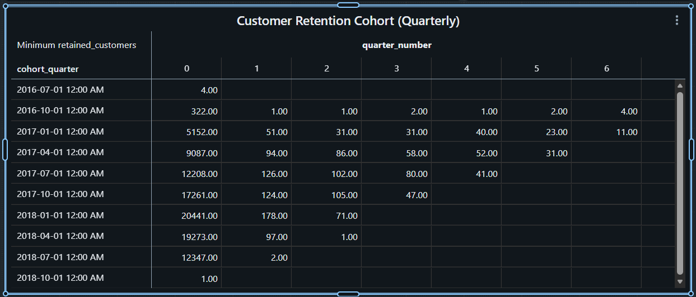
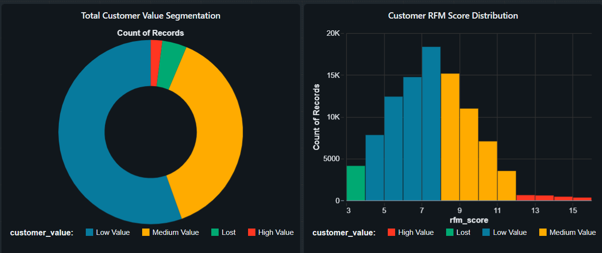
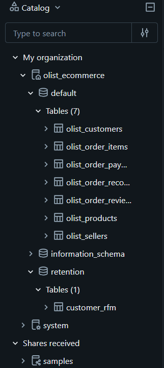

# 📦 Olist E‑Commerce Analysis


## 📖 Overview
This project analyzes the Brazilian E‑Commerce Public Dataset ([Olist_Dataset](https://www.kaggle.com/datasets/olistbr/brazilian-ecommerce/data)) using Azure Databricks connected to Azure Data Lake Storage (ADLS).
The goal is to build a scalable Medallion architecture and perform customer retention analysis with advanced techniques such as cohort analysis, hypothesis testing, and RFM scoring.
Interactive dashboards were created in Databricks to visualize insights.

## 🏗 Architecture
```text
 ┌───────────────────────────────────────────────────────────────┐
 │                         DATA LAYER                            │
 │   [Raw Olist CSVs] → [ADLS Gen2] → [Databricks Bronze Tables] │
 │   Cleaning & Transformation → [Silver Tables] → [Gold Tables] │
 └───────────────────────────────────────────────────────────────┘
                                 │
                                 ▼
 ┌───────────────────────────────────────────────────────────────┐
 │                        ANALYTICS LAYER                        │
 │   Cohort Analysis → Customer Retention                        │
 │   Hypothesis Testing → Statistical Validation                 │
 │   RFM Scoring → Customer Segmentation                         │
 └───────────────────────────────────────────────────────────────┘
                                 │
                                 ▼
 ┌───────────────────────────────────────────────────────────────┐
 │                        DASHBOARD LAYER                        │
 │   Databricks Visualizations & Dashboards                      │
 │   Customer Retention Trends, Segments, KPIs                   │
 └───────────────────────────────────────────────────────────────┘
 ```
## 🔑 Key Features
* **Medallion Architecture:** Bronze → Silver → Gold layers for clean, curated data.

* **Cohort Analysis**: Measured customer retention over time.

* **Dashboards:** Built in Databricks for interactive exploration.

* **Hypothesis Testing:** Validated statistical relationships (e.g., spend vs retention).

* **RFM Scoring:** Segmented customers by Recency, Frequency, and Monetary value.

* **Future Work:** **Extend experiments with RFM segments and additional hypothesis tests.**

## 📊 Insights
* Retention patterns identified via cohort analysis.

* High‑value customers segmented using RFM scoring.

* Hypothesis testing provided evidence for relationships between spending and loyalty.

* Dashboards enabled business‑ready visualization of KPIs.

## 🛠 Tech Stack
* **Big Data & Cloud:** Azure Databricks, ADLS Gen2

* **Data Engineering:** PySpark, SQL, Medallion Architecture

* **Analytics:** Cohort Analysis, Hypothesis Testing, RFM Scoring

* **Visualization:** Databricks Dashboards

## 🚀 Future Enhancements
1. Deeper RFM experiments (e.g., Adjusting Frequency, testing Expectations and Reality).

2. Additional hypothesis testing on customer behavior.

3. Integration with Azure ML for predictive modeling.

## 📂 Repository Structure
```Code
├── Customer_analysis_nbs/
│   ├── rfm_experimants.ipynb
│   └── hypothesis_tests.ipynb
|
├── Dashboards/
│   └── olist_dashboard  #databricks dashboards
|
├── Medallion_arch_nbs/
|   ├── data_update_job.py  #to run as job in databricks
|   ├── gold_etl.ipynb 
|   ├── silver_etl.ipynb
│   └── olist_dataset (stored in ADLS)
|
└── README.md
```

## 📊 Dashboards Pics




## 🗂 Unity Catalog Pics


